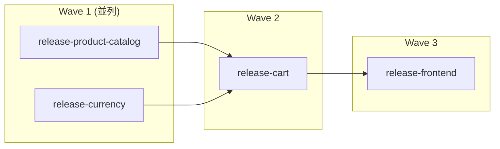
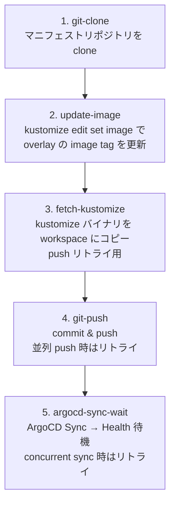

# Progressive Release Pipeline

## 1. 概要

### 目的

OpenShift Pipelines (Tekton) を使い、OTel Demo の **イメージタグ更新 → Git push → ArgoCD Sync → Healthy 待機** を自動化する Pipeline。

GitOps ワークフローにおける「マニフェスト変更の自動化」レイヤーに位置し、開発者は `tkn pipeline start` で新バージョンのタグを指定するだけで、依存関係を考慮した段階的リリース（Wave 方式）が実行される。

### スコープ

| やること | やらないこと |
|----------|-------------|
| image tag の書き換え (kustomize edit set image) | アプリケーションの src ビルド・push |
| Git commit & push | Webhook / EventListener による自動トリガー |
| ArgoCD Application の Sync & Health 待機 | stg / prod 環境へのリリース |
| Wave 順序制御による段階的リリース | 自動 Rollback（Git revert は手動） |
| 失敗時の Pipeline 停止 | Secret のローテーション |

## 2. 構成図

### Wave 構成と依存関係



Wave 1 の 2 タスクは `runAfter` 指定なしで並列実行される。Wave 2 は Wave 1 の全タスク完了後、Wave 3 は Wave 2 完了後に開始する。いずれかの Wave で失敗した場合、後続の Wave はスキップされる。

### update-and-sync Task の内部 Step



**リトライ機構:**

- **git-push**: Wave 1 の並列タスクが同一ブランチに push するため、`rejected` エラーが発生しうる。失敗時は `git reset → pull → kustomize re-apply → commit → push` を最大 5 回リトライする。
- **argocd-sync-wait**: 同一 Application に対する並列 sync で `another operation is already in progress` エラーが発生しうる。最大 12 回（10 秒間隔）リトライする。

## 3. 前提条件

| コンポーネント | 要件 |
|---------------|------|
| OpenShift Pipelines Operator | インストール済み（Pipeline v0.62.x 以上） |
| OpenShift GitOps Operator | インストール済み、ArgoCD インスタンス稼働中 |
| Argo Rollouts | RolloutManager が稼働中 |
| ArgoCD Application | `otel-demo-dev` が Synced & Healthy |
| GitHub リポジトリ | マニフェストリポジトリに push 権限あり |
| tkn CLI | パイプライン実行・ログ確認用（任意） |

## 4. セットアップ手順

### 4.1 Namespace 作成

```bash
oc new-project otel-demo-ci
```

### 4.2 ServiceAccount 作成

```bash
oc create serviceaccount pipeline-sa -n otel-demo-ci
```

### 4.3 ArgoCD API Token 発行

#### 4.3.1 pipeline ユーザーを ArgoCD に追加

```bash
oc patch argocd argocd -n openshift-gitops --type merge \
  -p '{"spec":{"extraConfig":{"accounts.pipeline":"apiKey"}}}'
```

#### 4.3.2 RBAC 設定（sync と get のみ許可）

```bash
oc patch argocd argocd -n openshift-gitops --type merge \
  -p '{"spec":{"rbac":{"policy":"g, pipeline, role:readonly\np, role:pipeline-sync, applications, sync, */*, allow\np, role:pipeline-sync, applications, get, */*, allow\ng, pipeline, role:pipeline-sync"}}}'
```

#### 4.3.3 API Token 生成

admin パスワードを取得:

```bash
ARGOCD_PASSWORD=$(oc get secret argocd-cluster -n openshift-gitops \
  -o jsonpath='{.data.admin\.password}' | base64 -d)
```

ArgoCD サーバーの Route を取得:

```bash
ARGOCD_SERVER=$(oc get route argocd-server -n openshift-gitops \
  -o jsonpath='{.spec.host}')
```

admin でログインしてセッション取得:

```bash
SESSION=$(curl -sk "https://${ARGOCD_SERVER}/api/v1/session" \
  -d "{\"username\":\"admin\",\"password\":\"${ARGOCD_PASSWORD}\"}" \
  | python3 -c "import sys,json; print(json.load(sys.stdin)['token'])")
```

pipeline ユーザーの API Token 生成:

```bash
ARGOCD_TOKEN=$(curl -sk -X POST \
  "https://${ARGOCD_SERVER}/api/v1/account/pipeline/token" \
  -H "Authorization: Bearer ${SESSION}" \
  -H "Content-Type: application/json" \
  -d '{"expiresIn":"0"}' \
  | python3 -c "import sys,json; print(json.load(sys.stdin)['token'])")
```

#### 4.3.4 Secret 作成

```bash
oc create secret generic argocd-env-secret -n otel-demo-ci \
  --from-literal=ARGOCD_AUTH_TOKEN="${ARGOCD_TOKEN}" \
  --from-literal=ARGOCD_SERVER="${ARGOCD_SERVER}"
```

#### 4.3.5 ConfigMap 作成

```bash
oc create configmap argocd-env-configmap -n otel-demo-ci \
  --from-literal=ARGOCD_SERVER="${ARGOCD_SERVER}"
```

### 4.4 GitHub PAT の取得と Secret 作成

#### 4.4.1 PAT の作成

1. GitHub → Settings → Developer settings → Personal access tokens → Fine-grained tokens
2. **Repository access**: 対象のマニフェストリポジトリのみ
3. **Permissions**:
   - Contents: Read and write
   - Metadata: Read-only

#### 4.4.2 Secret 作成

```bash
oc create secret generic git-credentials -n otel-demo-ci \
  --type=kubernetes.io/basic-auth \
  --from-literal=username=<GitHub ユーザー名> \
  --from-literal=password=<GitHub PAT>

oc annotate secret git-credentials -n otel-demo-ci \
  "tekton.dev/git-0=https://github.com"
```

### 4.5 ServiceAccount に Secret を紐付け

```bash
oc patch serviceaccount pipeline-sa -n otel-demo-ci \
  --type merge -p '{"secrets":[{"name":"git-credentials"},{"name":"argocd-env-secret"}]}'
```

### 4.6 Tekton Task のインストール

argocd-task-sync-and-wait（参考用、本 Pipeline では Task 内に sync ロジックを内蔵）:

```bash
oc apply -n otel-demo-ci -f \
  https://raw.githubusercontent.com/tektoncd/catalog/main/task/argocd-task-sync-and-wait/0.2/argocd-task-sync-and-wait.yaml
```

update-and-sync Task と progressive-release Pipeline:

```bash
oc apply -n otel-demo-ci -f tekton/tasks/update-and-sync.yaml
oc apply -n otel-demo-ci -f tekton/pipelines/progressive-release.yaml
```

## 5. 実行手順

### 5.1 通常実行

```bash
tkn pipeline start progressive-release \
  -p image-tag=<新バージョン> \
  -w name=shared-workspace,volumeClaimTemplateFile=<(cat <<'EOF'
spec:
  accessModes: ["ReadWriteOnce"]
  resources:
    requests:
      storage: 256Mi
EOF
) \
  -w name=git-credentials,secret=git-credentials \
  --serviceaccount pipeline-sa \
  -n otel-demo-ci \
  --use-param-defaults
```

または PipelineRun テンプレートを使用:

```bash
IMAGE_TAG=2.2.0 envsubst < tekton/pipelineruns/progressive-release-run.yaml.tmpl \
  | oc create -n otel-demo-ci -f -
```

### 5.2 パラメータ

| パラメータ | 必須 | 説明 | 例 |
|-----------|------|------|-----|
| `image-tag` | Yes | デプロイするイメージタグ | `2.2.0`, `2.3.0` |

Task レベルのデフォルトパラメータ:

| パラメータ | デフォルト値 |
|-----------|-------------|
| `manifest-repo-url` | `https://github.com/tarosaiba/argo-rollouts-sample.git` |
| `manifest-repo-branch` | `main` |

### 5.3 状態確認コマンド

PipelineRun の一覧:

```bash
tkn pipelinerun list -n otel-demo-ci
```

実行中のログをフォロー:

```bash
tkn pipelinerun logs <pipelinerun-name> -f -n otel-demo-ci
```

TaskRun ごとの状態:

```bash
oc get taskrun -n otel-demo-ci \
  -l tekton.dev/pipelineRun=<pipelinerun-name> \
  -o custom-columns='NAME:.metadata.name,STATUS:.status.conditions[0].reason,START:.status.startTime' \
  --sort-by=.status.startTime
```

ArgoCD Application の状態:

```bash
oc get applications.argoproj.io otel-demo-dev -n openshift-gitops \
  -o custom-columns='SYNC:.status.sync.status,HEALTH:.status.health.status'
```

dev 環境の Deployment イメージ確認:

```bash
oc get deployment -n otel-demo-dev \
  -o custom-columns='NAME:.metadata.name,IMAGE:.spec.template.spec.containers[0].image'
```

## 6. トラブルシューティング

### Wave で失敗した時

1. **失敗した TaskRun を特定**:

   ```bash
   tkn pipelinerun describe <pipelinerun-name> -n otel-demo-ci
   ```

2. **該当 TaskRun のログを確認**:

   ```bash
   tkn taskrun logs <taskrun-name> -n otel-demo-ci
   ```

3. **どの Step で失敗したかで対処が変わる**:
   - `git-clone`: リポジトリ URL やブランチ名の誤り
   - `update-image`: app-name のマッピングにないコンポーネント名
   - `git-push`: Git 認証エラー（→ 後述）
   - `argocd-sync-wait`: イメージ pull 失敗、リソース不足、Rollout 停止

### Rollout が止まっている時

frontend は Blue/Green + Manual Promote のため、Analysis 完了後に手動 promote が必要:

```bash
# Rollout の状態確認
oc get rollout.argoproj.io frontend -n otel-demo-dev

# promote 実行
oc patch rollout.argoproj.io frontend -n otel-demo-dev \
  --type merge --subresource status \
  -p '{"status":{"promoteFull":true}}'
```

Pipeline は `argocd app wait --health` で Rollout が Healthy になるまで待機する。Rollout が Paused のままだと Pipeline はタイムアウト (600 秒) する。

### Git push 認証エラー

```
remote: Permission to <repo> denied to <user>.
fatal: unable to access 'https://github.com/...': The requested URL returned error: 403
```

1. **PAT の有効期限を確認**: GitHub → Settings → Developer settings → Personal access tokens
2. **PAT の権限を確認**: `Contents: Read and write` が必要
3. **Secret の内容を確認**:

   ```bash
   oc get secret git-credentials -n otel-demo-ci -o jsonpath='{.data.username}' | base64 -d
   ```

4. **Secret を再作成**:

   ```bash
   oc delete secret git-credentials -n otel-demo-ci
   oc create secret generic git-credentials -n otel-demo-ci \
     --type=kubernetes.io/basic-auth \
     --from-literal=username=<GitHub ユーザー名> \
     --from-literal=password=<新しい PAT>
   oc annotate secret git-credentials -n otel-demo-ci \
     "tekton.dev/git-0=https://github.com"
   ```

### ArgoCD Token 期限切れ時の再発行

Token を `expiresIn: "0"`（無期限）で発行している場合は期限切れしないが、Token を無効化・再発行する場合:

```bash
# 1. admin でログイン（SESSION 取得は 4.3.3 と同じ手順）

# 2. 新しい Token を生成
NEW_TOKEN=$(curl -sk -X POST \
  "https://${ARGOCD_SERVER}/api/v1/account/pipeline/token" \
  -H "Authorization: Bearer ${SESSION}" \
  -H "Content-Type: application/json" \
  -d '{"expiresIn":"0"}' \
  | python3 -c "import sys,json; print(json.load(sys.stdin)['token'])")

# 3. Secret を更新
oc delete secret argocd-env-secret -n otel-demo-ci
oc create secret generic argocd-env-secret -n otel-demo-ci \
  --from-literal=ARGOCD_AUTH_TOKEN="${NEW_TOKEN}" \
  --from-literal=ARGOCD_SERVER="${ARGOCD_SERVER}"
```

### Pipeline 失敗後の dev 環境復旧

Pipeline が不正なイメージタグを push した場合、dev overlay の `images` セクションを修正して復旧する:

```bash
# 1. overlay の現在の状態を確認
cat otel-demo/overlays/dev/kustomization.yaml

# 2. images セクションを削除（base のデフォルトタグに戻す）して commit & push

# 3. ArgoCD Sync を手動実行
oc patch applications.argoproj.io otel-demo-dev -n openshift-gitops \
  --type merge -p '{"operation":{"initiatedBy":{"username":"admin"},"sync":{}}}'
```

## 7. 制約と既知の制限

| 制約 | 説明 |
|------|------|
| **dev 環境のみ** | Pipeline は `otel-demo-dev` Application のみを対象とする。stg / prod へのリリースはディレクトリベースの昇格フロー（PR）で行う |
| **アプリビルドなし** | OTel Demo の公式イメージを利用。src のビルド・push は行わない |
| **Webhook 未実装** | Pipeline の実行は手動（`tkn pipeline start`）のみ。EventListener は未構築 |
| **全コンポーネント同一タグ** | Wave 内の全コンポーネントに同じ `image-tag` が適用される。個別タグ指定は未対応 |
| **Rollout Manual Promote** | frontend の Blue/Green Rollout は手動 promote。Pipeline は Healthy 待機するため、promote しないとタイムアウトする |
| **バージョン互換性** | イメージタグの変更のみで env vars は変更しない。メジャーバージョン間で env vars が変わった場合は base マニフェストの手動更新が必要 |
